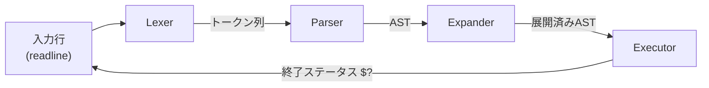

# 🐚 Minishell — a bash subset, rebuilt in C

[](https://github.com/Kizuna42/minishell/actions/workflows/ci.yml)


> **TL;DR (EN):** A from-scratch Unix shell written in C as a [42](https://42tokyo.jp/)
> project. It tokenizes a command line, parses it into an **AST**, and walks the tree
> to execute commands with full `fork`/`execve`, pipelines, redirections,
> here-documents, environment-variable expansion, quoting, seven builtins, and signal
> handling — plus `&&`/`||`/`;` and `*` globbing as bonus. ~4,300 lines across 60
> files, leak-checked with Valgrind, compiled with `-Wall -Wextra -Werror`.
> Design notes: **[docs/ARCHITECTURE.md](docs/ARCHITECTURE.md)**.

本プロジェクトは **bash のサブセットを C で一から再実装したシェル**です（42 課題）。
コマンドラインを字句解析 → 構文解析(AST) → 実行の 3 段で処理します。設計の詳細は
**[docs/ARCHITECTURE.md](docs/ARCHITECTURE.md)**、動作テストは `make test` を参照してください。

<p align="center">
  
</p>

### 🎯 実装範囲

- **コマンド実行**: 外部コマンドの実行と PATH 解決
- **ビルトインコマンド**: `echo`, `cd`, `pwd`, `export`, `unset`, `env`, `exit`
- **パイプライン**: コマンド間のデータフロー (`|`)
- **リダイレクション**: 入力/出力のファイルリダイレクト (`<`, `>`, `>>`)
- **ヒアドキュメント**: 複数行入力 (`<<`)
- **環境変数**: 変数の展開と管理 (`$VAR`)
- **クォート処理**: シングル・ダブルクォート内の文字列処理
- **シグナル処理**: `Ctrl+C`, `Ctrl+D`, `Ctrl+\`
- **論理演算子** (bonus): `&&`, `||`, `;`
- **ワイルドカード** (bonus): `*` パターンマッチング

---

## 🚀 動作イメージ・例

基本的なコマンド実行：

```bash
minishell$ ls -la
total 16
drwxr-xr-x  4 kizuna kizuna  128 Jan 25 20:00 .
drwxr-xr-x  3 kizuna kizuna   96 Jan 25 19:00 ..
-rw-r--r--  1 kizuna kizuna 1234 Jan 25 20:00 README.md
-rw-r--r--  1 kizuna kizuna 4567 Jan 25 20:00 Makefile
```

パイプラインとリダイレクション：

```bash
minishell$ ls | grep .c > output.txt
minishell$ cat output.txt
main.c
parser.c
executor.c
```

環境変数の展開：

```bash
minishell$ echo "Hello $USER, your home is $HOME"
Hello kizuna, your home is /Users/kizuna
```

ヒアドキュメント：

```bash
minishell$ cat << EOF
> This is a
> multi-line
> input
> EOF
This is a
multi-line
input
```

---

## ⚙️ セットアップ方法

### ビルド方法

```bash
# 基本版のビルド
make

# ボーナス機能付きビルド
make bonus

# クリーンビルド
make fclean && make
```

### テスト方法

```bash
# bash と出力を突き合わせる自動テスト（26 ケース）
make test

# 手動での動作確認
./minishell
./minishell_bonus      # ボーナス版

# Valgrind でメモリリーク検査
valgrind --leak-check=full ./minishell
```

---

## 📖 使用方法

### 起動方法

```bash
./minishell
```

プロンプト `minishell$ ` が表示されたら、通常の bash と同様にコマンドを入力できます。

### サポートされるビルトインコマンド

| コマンド | 説明                              | 使用例               |
| -------- | --------------------------------- | -------------------- |
| `echo`   | 文字列を出力 (`-n`オプション対応) | `echo "Hello World"` |
| `cd`     | ディレクトリ変更                  | `cd /path/to/dir`    |
| `pwd`    | 現在のディレクトリを表示          | `pwd`                |
| `export` | 環境変数を設定・表示              | `export VAR=value`   |
| `unset`  | 環境変数を削除                    | `unset VAR`          |
| `env`    | 環境変数一覧を表示                | `env`                |
| `exit`   | シェルを終了                      | `exit [code]`        |

### リダイレクト・パイプの記法

```bash
# 出力リダイレクト
command > file.txt

# 追記リダイレクト
command >> file.txt

# 入力リダイレクト
command < input.txt

# ヒアドキュメント
command << DELIMITER

# パイプライン
command1 | command2 | command3
```

### ボーナス機能

```bash
# 論理演算子
command1 && command2    # command1が成功した場合のみcommand2を実行
command1 || command2    # command1が失敗した場合のみcommand2を実行
command1 ; command2     # command1の結果に関係なくcommand2を実行

# ワイルドカード
ls *.c                  # .cで終わるファイルを表示
echo test_*             # test_で始まるファイル/ディレクトリを表示
```

---

## 🗂️ プロジェクト構成

### ディレクトリ構造

```
minishell/
├── Makefile                    # ビルド設定ファイル
├── README.md                   # プロジェクト説明書
├── includes/
│   └── minishell.h            # メインヘッダーファイル
├── libft/                     # 自作ライブラリ
│   ├── Makefile
│   ├── libft.h
│   └── src/                   # libft関数群
├── src/
│   ├── main.c                 # プログラムエントリポイント
│   ├── main_utils.c           # メイン補助関数
│   ├── lexer/                 # 字句解析モジュール
│   │   ├── lexer.c           # トークナイザー
│   │   ├── lexer_utils.c     # 字句解析補助
│   │   ├── lexer_quote.c     # クォート処理
│   │   └── tokenizer.c       # トークン生成
│   ├── parser/               # 構文解析モジュール
│   │   ├── parser.c          # AST構築
│   │   ├── parser_*.c        # 各種パーサー機能
│   │   └── ...
│   ├── executor/             # 実行エンジンモジュール
│   │   ├── executor.c        # メイン実行部
│   │   ├── builtin*.c        # ビルトインコマンド
│   │   ├── pipes.c           # パイプ処理
│   │   ├── redirections.c    # リダイレクト処理
│   │   └── ...
│   ├── utils/                # ユーティリティモジュール
│   │   ├── env_*.c           # 環境変数管理
│   │   ├── expand_*.c        # 変数展開
│   │   ├── wildcard*.c       # ワイルドカード処理
│   │   └── ...
│   └── bonus/                # ボーナス機能
│       ├── logical_ops.c     # 論理演算子
│       └── wildcards.c       # ワイルドカード拡張
```

### 主要モジュールの責任

1. **Lexer (字句解析)**

   - 入力文字列をトークンに分割
   - クォート処理、エスケープ文字の処理
   - 演算子とコマンドの識別

2. **Parser (構文解析)**

   - トークン列から抽象構文木(AST)を構築
   - 構文エラーの検出
   - 優先度に基づく演算子解析

3. **Executor (実行エンジン)**

   - AST を走査してコマンドを実行
   - プロセス管理 (fork/exec)
   - パイプ・リダイレクトの処理

4. **Utils (ユーティリティ)**
   - 環境変数の管理
   - 変数展開とワイルドカード処理
   - エラー処理とクリーンアップ

---

## 🔧 実装のハイライト

### AST ベースの構文解析

Minishell では、入力されたコマンドラインを以下の流れで処理します：

```
入力文字列 → Lexer → トークン列 → Parser → AST → Executor → 実行
```

この設計により、複雑なコマンドラインも構造化して処理できます。



> モジュール構成・文法・AST 例・実行モデルの詳細は
> **[docs/ARCHITECTURE.md](docs/ARCHITECTURE.md)** にまとめています。

### メモリ管理とエラー処理

- **厳密なメモリ管理**: 全ての動的メモリを適切に解放
- **リークフリー**: Valgrind でのメモリリーク 0 を保証
- **エラーハンドリング**: POSIX 準拠のエラーコードとメッセージ

### シグナル処理

```c
// グローバルシグナル状態管理
volatile sig_atomic_t g_signal_status = 0;

// Ctrl+C, Ctrl+\, Ctrl+Dの適切な処理
void setup_signal_handlers(void);
```

### fork/exec モデル

外部コマンドの実行は標準的な Unix プロセスモデルに従います：

```c
pid_t pid = fork();
if (pid == 0) {
    execve(path, args, envp);  // 子プロセスで外部プログラム実行
} else {
    waitpid(pid, &status, 0);  // 親プロセスで完了待機
}
```

---

## 🧪 実機デモ

実際に `./minishell` を起動して操作した例です（このリポジトリ上での実行結果）：

```text
minishell$ echo "minishell demo"
minishell demo
minishell$ pwd
/Users/kizuna/Developer/42/minishell
minishell$ export GREETING=Hello
minishell$ echo "$GREETING from $USER"
Hello from kizuna
minishell$ ls *.md
README.md
minishell$ cat .gitignore | grep -c "/"
8
```

---

## ✨ Engineering Highlights

- **AST ベースの設計**: トークン列を抽象構文木へ変換し、再帰下降パーサで
  `&&` / `||` / `|` / リダイレクトの優先度を入れ子の関数呼び出しとして表現。
  複雑な複合コマンドを統一的に実行できる。
- **正確なプロセス制御**: `fork` / `execve` / `waitpid` / `pipe` / `dup2` による
  標準的な Unix プロセスモデル。状態を変える必要のあるビルトイン（`cd`/`export`/
  `unset`/`exit`）は親プロセスで実行する、という設計判断を明確にしている。
- **メモリ安全性**: 1 行処理ごとにトークン/AST を生成・破棄し、
  `valgrind --leak-check=full` でリーク 0。FD もリダイレクト毎に退避・復元する。
- **bash 互換へのこだわり**: Ctrl+C 後の `$?`=130、複数 heredoc の処理順、
  未クォート区切りでの変数展開、ambiguous redirect 検出などのエッジケースを
  bash と突き合わせて実装。
- **42 Norm 準拠**: 関数 25 行 / ファイル 5 関数 / 引数 4 個などの制約下で、
  機能を細粒度のファイルに分割し可読性を確保。
- **クロスプラットフォーム**: Linux（42 評価環境）と macOS（Homebrew readline を
  Makefile が自動検出）の双方でビルド可能。

---

## 📚 学習リソース

このプロジェクトを理解するために推奨される学習リソース：

### Unix/Linux システムプログラミング

- **システムコール**: fork, exec, wait, pipe, dup2
- **シグナル処理**: signal, sigaction
- **ファイル操作**: open, read, write, close

### コンパイラ・インタープリター理論

- **字句解析**: トークナイザーの実装
- **構文解析**: 再帰下降パーサー、AST 構築
- **実行エンジン**: Tree-walking インタープリター

---
