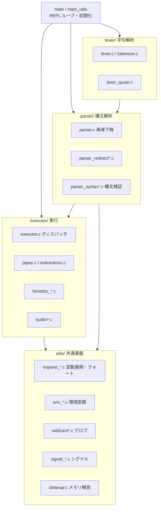
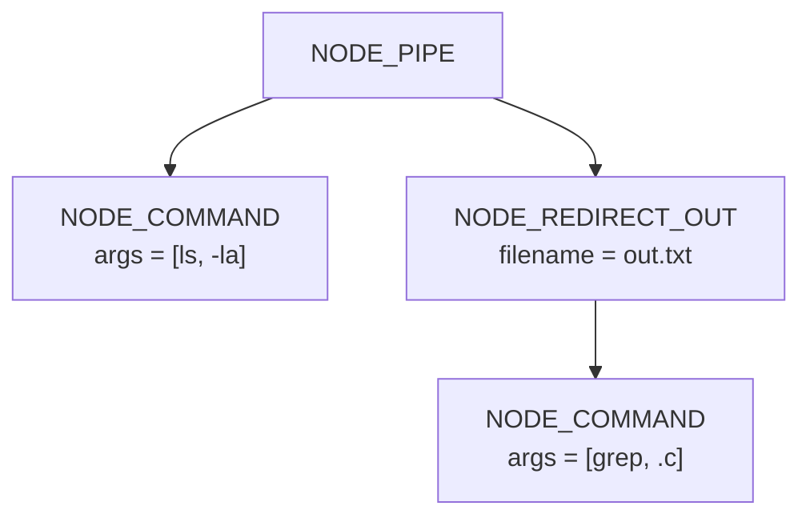
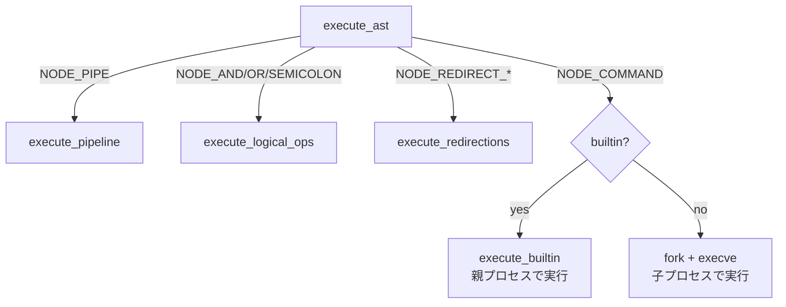

# Architecture / 設計ドキュメント

`minishell` は bash のサブセットを再実装した、ツリーウォーク型のコマンドインタプリタです。
入力一行を **字句解析 → 構文解析(AST) → 実行** の 3 段に分けて処理します。


この章では、各段の責務・データ構造・実行モデル・設計判断を説明します。

---

## 1. モジュール構成



| レイヤ | ディレクトリ | 主な責務 |
| --- | --- | --- |
| REPL | `src/main.c`, `src/main_utils.c` | プロンプト表示・1行読み込み・全体ループ・FDバックアップ |
| Lexer | `src/lexer/` | 文字列をトークン列へ。クォート/演算子の識別 |
| Parser | `src/parser/` | トークン列から AST 構築・構文エラー検出 |
| Executor | `src/executor/` | AST を走査し fork/exec・パイプ・リダイレクト・ビルトインを実行 |
| Utils | `src/utils/` | 変数展開・クォート除去・環境変数・グロブ・シグナル・解放 |
| Bonus | `src/bonus/` | `&&` `\|\|` `;` の制御演算子、`*` グロブ拡張 |

---

## 2. データ構造（`includes/minishell.h`）

```c
typedef struct s_token {        // 字句解析の出力(連結リスト)
    t_token_type   type;        // WORD / PIPE / REDIRECT_* / AND / OR / ...
    char          *value;
    int            quote_type;  // QUOTE_NONE / SINGLE / DOUBLE
    struct s_token *next;
} t_token;

typedef struct s_ast_node {     // 構文解析の出力(二分木)
    t_node_type        type;    // COMMAND / PIPE / REDIRECT_* / AND / OR / SUBSHELL
    char             **args;    // COMMAND ノードの argv
    char              *filename;// REDIRECT ノードの対象ファイル / heredoc 区切り
    struct s_ast_node *left;
    struct s_ast_node *right;
} t_ast_node;

typedef struct s_minishell {    // シェル全体の状態
    t_env  *env_list;           // 環境変数(連結リスト)
    char  **envp;               // execve(2) 用に同期した配列
    int     last_exit_status;   // $? の値
    int     stdin_backup;       // リダイレクト復元用
    int     stdout_backup;
} t_minishell;
```

環境変数を「連結リスト(`t_env`)」と「`char **envp` 配列」の二重持ちにしているのは、
`export`/`unset` での増減を扱いやすくしつつ、`execve(2)` には配列がそのまま渡せるようにするため。
変更時に `env_to_array()` で配列を再構築して同期する。

---

## 3. 文法と再帰下降パーサ

演算子の結合優先度を、関数呼び出しの入れ子で自然に表現している
（上ほど優先度が低い）。

```
logical   := pipeline (('&&' | '||' | ';') pipeline)*
pipeline  := command ('|' command)*
command   := (WORD | redirection)*
redirect  := ('<' | '>' | '>>' | '<<') WORD
```

| 文法規則 | 実装関数 | ファイル |
| --- | --- | --- |
| `logical`   | `parse_logical_ops()`  | `parser/parser_logical.c` |
| `pipeline`  | `parse_pipeline()`     | `parser/parser.c` |
| `command`   | `parse_command()`      | `parser/parser_command.c` |
| `redirect`  | `parse_redirections()` | `parser/parser_redirect.c` |
| 構文検証     | `validate_syntax()`    | `parser/parser_syntax.c` |

構文検証は実行前に独立して走り、`|` の連続・行末の演算子・閉じない括弧・
リダイレクト先欠落などを検出して、副作用を出さずに早期エラーする。

### AST 例: `ls -la | grep .c > out.txt`



`PIPE` ノードの左右をそれぞれ別プロセスで実行し、右側はコマンド実行前に
`out.txt` へ出力を張り替える。

---

## 4. 実行モデル

`execute_ast()` がノード種別でディスパッチする。



- **外部コマンド**: `find_command_path()` が `PATH` を走査して実体を解決し、
  `fork()` → `execve()` → `waitpid()`。終了ステータスを `$?` に反映する。
- **ビルトイン**: リダイレクトが無い単独実行時は **親プロセス**で実行する。
  `cd`/`export`/`unset`/`exit` はシェル自身の状態を変える必要があるため、
  子プロセスでは効果が消えてしまうのがその理由。
- **パイプライン**: `pipe(2)` で接続し、各辺を `fork` して `dup2(2)` で
  stdin/stdout を張り替える。親は両 FD を閉じてから両子を待つ。
- **リダイレクト**: 実行前に `stdin_backup`/`stdout_backup` へ退避し、`open`+`dup2`
  で張り替え、コマンド後に `restore_std_fds()` で必ず復元する。

### Heredoc の方針

`<<` は `pipe(2)` に本文を書き込み、その読み出し端を stdin に差し替える。
本文は **制御端末(tty) から逐次読み取る**実装で、対話 bash と同じ体感になる
（区切り行が来るまで読み続け、未クォートの区切りなら本文中の `$VAR` を展開する）。
複数 heredoc（`cat << a << b`）は順に処理し、最後の区切りの内容のみを
コマンドの stdin に渡す — これは bash の挙動に合わせたもの。

---

## 5. 変数展開とクォート

字句解析の後、各 WORD は展開パイプラインを通る。

```
$VAR / $? / $$ の展開  →  ~ のチルダ展開  →  クォート除去  →  (未クォート時) グロブ
```

- シングルクォート内はリテラル（展開なし）。
- ダブルクォート内は `$` 展開とバックスラッシュ処理あり、グロブなし。
- `expand_*.c` 群が、ANSI-C 風 `$'...'`・バックスラッシュ・空変数の畳み込みなど
  細部のケースを個別ファイルに分割して処理する（42 Norm の関数行数制約への対応も兼ねる）。

---

## 6. シグナル設計

```c
extern volatile sig_atomic_t  g_signal_status;   // 唯一許可されるグローバル
```

- 対話時の `Ctrl+C` (SIGINT) は、ハンドラ内で最小限の処理だけ行い
  （`g_signal_status` 更新と readline の行リセット）、async-signal-safe に保つ。
- `Ctrl+\` (SIGQUIT) は対話時は無視。
- 子プロセス実行中は `setup_child_signal_handlers()` で既定動作に戻し、
  シグナルがそのまま子に届くようにする。
- 割り込まれた行の `$?` は 130 になる（bash 互換）。

グローバルを 1 個に限定しているのは 42 Norm の要件であると同時に、
シグナルハンドラから安全に触れる状態を最小化する設計上の意図でもある。

---

## 7. メモリ所有権

各段が生成したオブジェクトは、対応する解放関数で必ず回収する。

| 生成物 | 解放関数 |
| --- | --- |
| トークン列 | `free_tokens()` |
| AST | `free_ast()`（再帰） |
| 環境変数リスト/配列 | `free_env()` / `free_args()` |
| シェル全体 | `cleanup_minishell()` |

1 行処理の各回でトークンと AST を生成・破棄し、リークを残さない
（`valgrind --leak-check=full` で確認）。FD もリダイレクト毎に
退避・復元してリークさせない。

---

## 8. bash との既知の差分

- `heredoc` は制御端末から本文を読むため、スクリプトを丸ごと標準入力から
  パイプした場合（`printf '... << EOF ...' | minishell`）は本文を取り込めない。
  対話実行・テスト実行では期待どおり動作する。
- ジョブ制御（`fg`/`bg`/`&` の完全なジョブ管理）は未対応。
- 算術展開 `$(())`・コマンド置換 `$(...)` は対象外（課題スコープ外）。

---

## 参照

- ビルド/使い方: [../README.md](../README.md)
- 動作テスト: リポジトリ直下 `make test`（`test.sh`）
